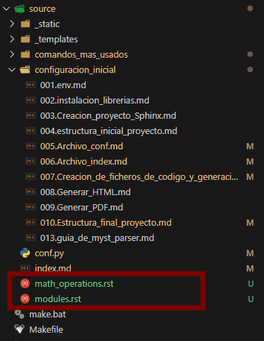
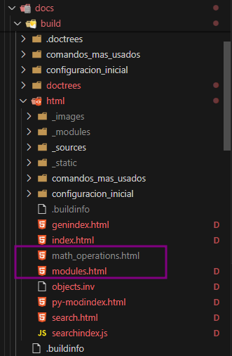

# **Creación de ficheros de código y generación automática de documentación**

## 1. Creación del fichero de código Python

Se crea un fichero de código Python con **docstring en formato Google Style**. Este formato facilita la generación automática de documentación, ya que utiliza una estructura clara y legible tanto para humanos como para herramientas de generación de documentación.  

```{literalinclude} ../../../src/math_operations.py
:language: python
:linenos:
```

Explicación del formato Google Style:
- Args: Define los argumentos que la función recibe, indicando su nombre, tipo y propósito.
- Returns: Describe lo que devuelve la función, incluyendo el tipo de dato.
- Raises(opcional): Especifica las excepciones que la función podría lanzar.

Este formato garantiza que la documentación sea clara y estandarizada.

### 1.2. Pasos para generar la documentación automáticamente

1.  **Instalación de Sphinx**:  
    Hay que asegurarse de tener Sphinx instalado en el entorno de trabajo. Si no, hay que instalarlo con:
    
    ```bash
    pip install sphinx
    
    ```

2.  **Activación entorno virtual**:  
    Hay que asegurarse de tener activado el entorno virtual en el entorno de trabajo. Si no, hay que activarlo con:
    
    ```bash
    env\Scripts\activate
    
    ```    
    
3.  **Ejecución de sphinx-apidoc**:  

    `sphinx-apidoc` es una herramienta de línea de comandos incluida en Sphinx que genera automáticamente archivos de documentación para módulos y paquetes Python. 
    Su propósito principal es agilizar el proceso de creación de documentación basada en docstrings, generando archivos de entrada para Sphinx a partir de la estructura del código fuente.
    Esta herramienta es especialmente útil en proyectos grandes con múltiples módulos y paquetes, ya que automatiza la creación de archivos de documentación necesarios para cada módulo, en el formato configurado (por ejemplo, .rst, .md o cualquier otro formato compatible).
        
    ```bash
    sphinx-apidoc -o .\source\ ../src --separate 
    
    ```
    
    -   **`-o .\source\`**: Indica la carpeta donde se generarán los archivos de documentación.
    -   **`../src`**: Especifica el directorio donde se encuentran los archivos de código Python.
    -   **`--separate`**: Genera un archivo separado para cada módulo detectado en lugar de consolidar toda la documentación en un único archivo.

    Al ejecutar el comando sphinx-apidoc, en nuestro caso los archivos generados son:
    - math_operations.rst
    - modules.rst

📸 **Ejemplo de archivos creados:**

 

4.  **Compilación de la documentación**:  
    Una vez se tengan los archivos generados, hay que compilar la documentación usando:

    - Hay que navegar al directorio de documentación (`docs/`):
    
    ```bash    
    cd docs
    ```
    
    - Luego hay que ejecutar el siguiente comando para generar la documentación HTML:
    
    ```bash
    make.bat html  
    ```
    
    Esto creará una carpeta `docs/build/html/` con los archivos HTML de la documentación generada.

📸 **Ejemplo de html creados:**

 

**Enlace directo a la documentación HTML**:  

 <a href="../../html/math_operations.html" target="_blank">Ver la documentación del módulo html math_operations</a>

----------

## 2. Resultados obtenidos

Cuando ejecutas el comando `sphinx-apidoc`, se generan una serie de archivos en el directorio `docs/source` que contienen la estructura básica de la documentación para el proyecto. Este comando facilita la generación automática de documentación a partir del código fuente, especialmente de los docstrings de los módulos y clases Python.

### 2.1. **Estructura de Archivos Generada**

Al ejecutar `sphinx-apidoc -o docs/source src/`, se creará una serie de archivos en la carpeta `docs/source`:

#### a. **Archivos `.rst` para cada módulo Python**

Cada módulo de Python dentro de la carpeta `src/` tendrá un archivo generado. Nuestro proyecto tiene el módulo 
 `math_operations.py`, se genera el archivo:

-   `math_operations.rst`

Este archivo contienen la documentación generada a partir de los docstrings de los módulos. Por ejemplo, si tu módulo `math_operations.py` tiene funciones con docstrings, el archivo generado incluirá lo siguiente:

```
math\_operations module
=======================

.. automodule:: math_operations
   :members:
   :undoc-members:
   :show-inheritance:

```

Este archivo generado tiene varias secciones importantes:

-   **`automodule:: math_operations`**: Esto indica que Sphinx debe generar la documentación automáticamente para el módulo `math_operations`.
-   **`:members:`**: Esto genera la documentación para todas las funciones y clases dentro del módulo.
-   **`:undoc-members:`**: Si hay funciones o clases sin docstrings, esta directiva las incluirá en la documentación.
-   **`:show-inheritance:`**: Si hay clases, muestra también la jerarquía de herencia.

Este es el formato que Sphinx usa para incluir la documentación del código fuente, asegurándose de que los cambios en los archivos de código fuente se reflejen automáticamente en la documentación.

#### b. **`modules.rst` **

Este archivo lista todos los módulos generados, lo cual es útil si hay muchos módulos en el proyecto. Por ejemplo:

```
src
===

.. toctree::
   :maxdepth: 4

   math_operations


```

Este archivo crea un índice de módulos que Sphinx incluirá en la documentación final.

### 2.2. **Contenido de los Archivos Generados**

#### a. **Documentación Generada Automáticamente desde el Código**

El objetivo principal de `sphinx-apidoc` es generar documentación automáticamente a partir de los docstrings en el código Python. Para cada archivo `.py` que contiene docstrings, se generará una representación en reStructuredText.

Por ejemplo, nuestro archivo `math_operations.py` con el siguiente código:

```python
def add_numbers(a, b):
    """Suma dos números."""
    return a + b

```

El archivo `math_operations.rst` generado tendrá algo similar a esto:

```rst
math\_operations module
=======================

.. automodule:: math_operations
   :members:
   :undoc-members:
   :show-inheritance:

```

La directiva `automodule` incluye el módulo completo, y las funciones o clases del módulo se detallan debajo con sus respectivas descripciones.

#### b. **Incluir Todo el Código del Proyecto**

Los archivos generados también incluyen código fuente si usamos la extensión `viewcode` en el archivo `conf.py` de Sphinx. Esto agrega enlaces al código fuente y puede incluir la visualización completa del código si se activa la opción correspondiente.

#### c. **Dependencias de Módulos**

Si el proyecto tiene dependencias de otros módulos dentro de `src/`, el sistema de documentación puede generar automáticamente enlaces a esos módulos y sus funciones.

### 2.3. **Uso de los Archivos Generados**

Una vez que `sphinx-apidoc` ha generado estos archivos, puedes:

-   **Editar manualmente** el archivo `index.rst` o `index.md` para personalizar la estructura de la documentación.
-   **Incluir o excluir módulos** de la documentación generada editando los archivos `.rst` o `.md` generados.
-   **Ejecutar `sphinx-build`** para generar la documentación final en formato HTML, PDF, etc.

Por ejemplo, se puede generar la documentación HTML con el siguiente comando:

```bash
sphinx-build -b html source build

```

Esto generará una carpeta `build` que contendrá la documentación final en formato HTML. Se pueden abrir estos archivos en el navegador para visualizar la documentación generada.

### 2.4. **Personalización de la Documentación Generada**

Aunque los archivos generados por `sphinx-apidoc` contienen una buena base de documentación, se pueden personalizar aún más, por ejemplo:

-   **Agregar enlaces y referencias**: Se puede usar `:ref:` y `:doc:` para vincular otros documentos generados por Sphinx.
-   **Agregar secciones adicionales**: Se puede agregar más texto explicativo o personalizar la apariencia con archivos CSS o HTML.

## 3. Conclusiones

-   **Automatización**: El uso de `sphinx-apidoc` simplifica la generación de documentación a partir de código Python, ahorrando tiempo y esfuerzo.
-   **Legibilidad**: El uso de docstring en formato Google Style mejora la claridad y consistencia de la documentación.
-   **Compatibilidad**: Los archivos `.rst` generados por Sphinx son fácilmente convertibles a otros formatos, como `.md`, para adaptarse a distintas necesidades de publicación.

Esta metodología no solo mejora la calidad de la documentación, sino que también reduce el tiempo necesario para su mantenimiento y actualización.