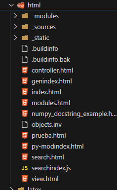

# **Generación de HTML a partir de la documentación**

La generación de documentación HTML es uno de los puntos clave en un flujo de trabajo con **Sphinx** y **MyST-Parser**. Este proceso convierte los archivos fuente (Markdown o reStructuredText) en una interfaz web navegable y estilizada.

----------

## 1. Preparar la estructura del proyecto

Asegúrate de que la estructura de tu proyecto tiene la siguiente organización básica:

```
docs/
├── source/
│   ├── conf.py        <- Archivo de configuración principal
│   ├── index.md       <- Página principal (puede ser index.rst o index.md)
│   ├── _static/       <- Recursos estáticos (imágenes, CSS, JS)
│   ├── _templates/    <- Plantillas personalizadas para HTML
│   └── secciones/     <- Más archivos .md o .rst
└── make.bat          <- Script para construir la documentación (Windows)
└── Makefile          <- Script para construir la documentación (Linux/macOS)
```
----------

## 2. Crear contenido en Markdown

En la carpeta `source`, crea o edita el archivo `index.md` (o `index.rst` si trabajas con reStructuredText).

### 2.1. Ejemplo de index.md:

```markdown
# Documentación del Proyecto

¡Bienvenido a la documentación oficial del proyecto!

## Introducción

Esta documentación cubre todas las características clave.

## Secciones

- [Instalación](instalacion.md)
- [Uso Básico](uso_basico.md)

## Referencias

Más información en [referencia técnica](referencia.md).
```

⚠️ **Importante:** En caso de usar Markdown, asegúrate de que en `conf.py` tengas habilitado MyST-Parser:

```python
extensions = [
    "myst_parser"
]
```
----------

## 3. Configurar la salida HTML en conf.py

Abre el archivo `conf.py` y verifica lo siguiente:

```python
# Tema HTML
html_theme = 'sphinx_rtd_theme'

# Directorios de recursos estáticos
html_static_path = ['_static']

# Tipo de archivos fuente
source_suffix = {
    '.rst': 'restructuredtext',
    '.md': 'markdown',
}
```

Estas configuraciones aseguran que Sphinx procese correctamente los archivos `.md` y genere la salida en HTML.

----------

## 4. Generar la documentación HTML

- **Windows:**
Abre una terminal en la carpeta raíz de tu proyecto (donde está `make.bat`) y ejecuta:
	```cmd
	make.bat html
	```

- **Linux/macOS:**
En terminal, usa el comando:

	```bash
	make html
	```

### 4.1. ¿Qué sucede aquí?

-   Sphinx lee los archivos `.md` o `.rst` en el directorio `source`.
-   Convierte estos archivos en HTML.
-   El resultado se guarda en el directorio `build/html`.

----------

## 5. Explorar la salida HTML

Una vez finalizado el proceso, navega hasta:

```bash
docs/build/html/index.html
```

-   Abre el archivo `index.html` en tu navegador web preferido.
-   Deberías ver una interfaz estilizada con el contenido de tu documentación.

### 5.1. Ejemplo de salida HTML:

